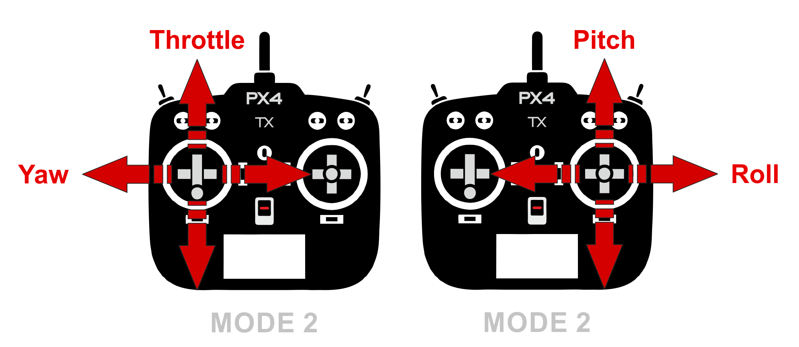

# Challenge 1: Getting Started and Drone "Run Up"

Author: Xuan Wang

As the first challenge of this capstone course, each team is to assemble the drone, configure it properly, and pass the "run up" demo to prove that your aircraft is **air-worthy**. The demo will happen soon after the Feb. 7th class, with each team finding a time slot to meet with TAs. During the "run up" demo, everything will happen on the ground, and the teams should follow and pass all the [checklist items provided for the course](https://q.utoronto.ca/courses/299314) interviewed by TAs probably with some simple questions, to show that they have **fully understood** all the safety guidelines and pre-flight/postflight procedures. **Before the completion of the demo, no team should install their propellers and arm the drone**. If the checklist is passed, the head TA will help you do a quick test flight. This challenge might not be too technically complexed, but is still the most important one to form a good foundation for your safety and higher-end challenges.

This manual will help you get started with the brief and core steps of assembling the hardware and configuring the basic software of the drone for this course. PX4 is the recommended open-source firmware for the pixhawk 4 mini autopilot flight controller. Other than that, Ardupilot firmware-GCS ecology is also popular, but you are free to use any other ones if you would like. Note that the low-level drone controlling code are not expected to be written by students since the complexity is out-of-scope of undergraduate level. This is why the PX4 open-source firmware has been and is still being activly developed by thousands of outstanding engineers around the world. The work of this course could also make great contributions to this open-source community.

For this entire course, the **main reference is the [PX4 autopilot official documentation](https://docs.px4.io/main/en/)**, (many other languages are available!). It provides all the information you could find from knowing the basic concepts of drones to the advanced configurations. As many other documentations you will see in your life, you do not have to read everything there. The point of this instruction is to try to make you not feel so lost in there.

## Hardware Setup
Within the kit you will find that the power distribution board is already soldered with ESCs and motors to save your time. However, you are still expected to find out the rest correct avionics connections, using all the related resources:

- Make sure the pixhawk 4 is powered properly from the PDB (Power Distribution Board)
- ESC connections to the pixhawk for motor control
- RC (Remote control) receiver connection to the pixhawk
- TeraRanger EVO 60m connection to the pixhawk

Hint/advice: Not all detailed info/how-to is provided in this manual, you are expected to check the docs/pinouts/official websites of all the avonic parts to get more information. It is also recommended to learn to manage your team's own docs as you are using more of them and increasing complexity. One thing that I could put right at here and you will use a lot is the ESC & motor numbering and rotation direction as recongized by the flight controller:

## Firmware/Ground Station Setup
In real life, the correct avonic connections cannot ensure that they will work properly at all. You also need to setup the firmware of the pixhawk 4. All the settings and parameters can be modified with the ground control station (GCS) software. It is recommended to use QGroundControl (referred to as **QGC** in the following sections), which supports most OS.

First open the QGC, click the logo on the top left to enter the vehicle setup page. Update the firmware to the latest version as instruced on the screen, make sure the airframe is selected as "Generic Quadcopter". Everytime you plug in the pixhawk again using micro USB cable, the QGC should auto detect it and connect.

If you go to vehicle setup after the firmware update, you will see a list of items to do on the left of the screen, please check in sequence and configure accordingly. The key settings are:

- Airframe (Generic Quadcopter)
- Sensors (Calibrate everything for the first setup, or whenever you think necessary)
- Radio **(to be explained more in detail in the next section)**
- Flight modes **(to be explained more in detail in the next section)**
- Motors testing (Make sure the rotation direction is correct)
- Safety (Low Battery -> Land; RC Loss -> Kill)
- Parameters (Much more flexible settings!)

Try not to modify the PID parameters whcih would cause unstability. For motor testing, you can use a wide strip of paper/plastic to touch the top of the motor to reveal the direction. In any case that the motor direction is incorrect, you could confige it using the BLHeli-S software to turn the ESCs. Fun fact: you can even make your ESC to control the motors to "sing" using this software! Doing this could win your team a bonus of 1% :) 

## Radio Setup
As introduced above, radio setup and flight modes need more work and standard setups. It may also take some time for you to learn how to use the Taranis Remote Control Transmitter (will be referred to as "Taranis" in the following parts) since it provides a lot of flexibilities and is more advanced than the toy-level remote controllers!

To setup the radio, you to need first bind it with the RC receiver (the ARCHER R4) following the instructions on its manual (have a hardcopy with the module, you can also always find it online), and check in the "Radio" tab if you can see the reactions. If the receiver is stuck in the reg mode, contact TA. 

The attitude control is generally mapped as "American Hand" as shown in the figure below, if you would like to control in other fasion, please notify the Head TA. Remeber to also do the calibration for the first time setup, and make sure that the channel mappings are correct (for example, you do not want moving throttle on the RC and it appreas to be pitch on the flight controller!). If the mapping is incorrect, you can change the channel setting in Taranis.

## Flight Mode Setup

In the Flight Mode section in QGC, you could assign channels for flight mode switch, arm switch, and **emergency kill switch**. The suggested channel/switch mapping for them is listed in the table below. The flight modes that we will be using in this course is "Stabilized", "Altitude", and "Offboard". They are explained well in the PX4 doc, "Flying" section. Please read carefully and make sure you understand well on both the behaviour and the sensors involved. 

| Switch Name (Function) | Hardware Switch | Channel |
|------------------------|-----------------|---------|
|Flight Mode Switch      |SB (longest stick on the front panel)| Channel 5 |
|Arm Switch              |SA/SC (shorter sticks on the front panel)| Channel 6 |
|Emergency Kill Switch   |SD (left top side switch, sorry for other-handed person)| Channel 7 |

To be able to switch the flight mode, you need to first setup the Taranis to map between the hardware switches to the wireless channels. This can be found by pressing [MENU] button, and then press [PAGE] to enter the detailed model settings; short press the [PAGE] button to loop through the pages (long press goes back, fun fact: I have been using Taranis for four years and just found this recently :)) until the page 6/12, the MIXES, where you will find all the empty channels to be allocated from channel 5. The modified profile could look like this:

Once this is done, back to QGC, and you could simply select among channels to map them to the functions accordingly. If your RC connection is active, you will be able to see the function name highlighted when you flip the switches. 

## Final Checks
If you have done everything correct, you will be able to see this on the top left corner in the main page:

However, this only means that your pixhawk is ready to Arm, but your drone might still not be ready to fly. Before you can call the drone air-worthy, please carefully check:

- Can I arm the drone, switch to whatever flight mode, and **kill** it whenever I want?
- Are all the components installed tight and in proper positions?
- Are the motors rotating in correct directions?

Finally and most importantly, I cannot emphasize more on the importance of the **safety checklist and safety always in your mind**. Please make sure all your team members fully understand it, and **do serious rehearsals** before the demo (we will pick a random number as the "pilot" to hold the Taranis!). Just like the strtict safety requirement in the real aviation system, you will only have one chance for the demo, and failure on just one part could lose all your mark for this challenge.

If you have any questions, feel free to google, post on discussion board, or ask the TAs. You are given a fairly long time for this task, so if you finish early, it is strongly recommended to breakdown the work into small-tasks, distribute roles among team members and plan your timeline ahead. There are a lot ahead of you to continue to look into such as configuring your Jetson nano, modifying/redesigning/printing the chassis, learning to do simple hover, using the Vicon system, and using the MAVLink API(MAVSDK/MAVROS) to control the Pixhawk with Jetson nano. The better you learn these, the more you could do with this drone platform and the furthur you will go in this project.

 
