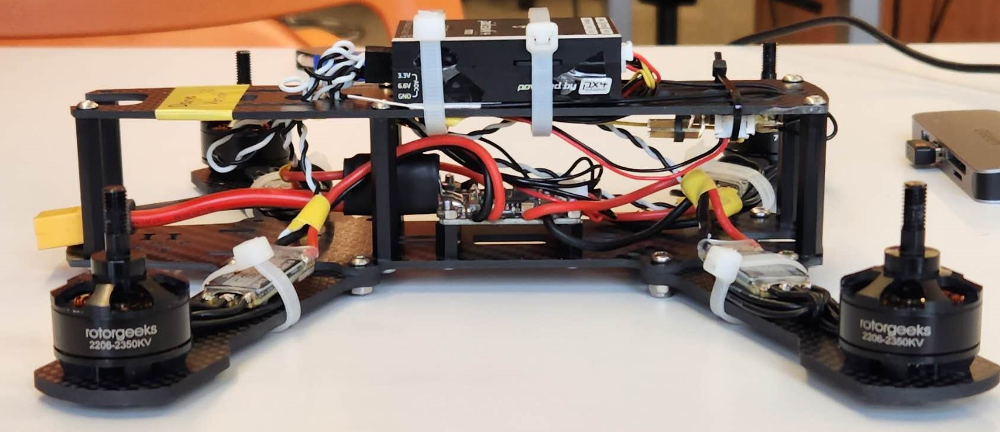

# Challenge 1: Getting Started and Drone "Run Up"

Author: Xuan Wang

As the first challenge of this capstone course, each team needs to assemble the drone, configure it properly, and pass the "run up" demo to prove that your aircraft is **air-worthy**. The demo will happen soon after the Feb. 7th class, with each team finding a time slot to meet with TAs. During the "run up" demo, everything will happen on the ground, and the teams should follow and pass all the [checklist items provided for the course](https://q.utoronto.ca/courses/299314) interviewed by TAs, probably with some simple questions, to show that they have **fully understood** all the safety guidelines and pre-flight/postflight procedures. **Before the completion of challenge 1, no team should install their propellers and fly the drone**. If the checklist test is passed and there is time left, the head TA can help you do a quick test flight. This challenge might look simple, but it is the most critical part of building a good foundation for safety and higher-end challenges.

This manual will help you get started with the brief and core steps of assembling the hardware and configuring the basic software of the drone for this course. PX4 is the recommended open-source firmware for the pixhawk 4 mini autopilot flight controller. Besides, Ardupilot firmware-GCS ecology is also widely used, and you are free to use any other ones as you wish. Students are not expected to write low-level drone controlling code since the complexity is out-of-scope of the undergraduate level. This is why the PX4 open-source firmware has been and is still being actively developed by thousands of outstanding engineers worldwide. This course's work could also greatly contribute to this open-source community.

For this course, the **main reference is the [PX4 autopilot official documentation](https://docs.px4.io/main/en/)**, (many other languages are available!). It provides all the information you can find, from the basic concepts of drones to advanced configurations. As you might have noticed, you do not need to read everything from the documentations. The point of this instruction is to make you not feel so lost in them.

## Hardware Setup
You may want to start assembling your [frame](https://rotorgeeks.com/download/Minion-Assembly-Manual.pdf) as the first step. The finished one should look as shown in the frame manual and the example figure below. To align with the default chassis, the "wide side" of the drone should point forward.

Within the kit, you will find that the PDB (power distribution board) is already soldered with ESCs (Electric Speed Controller) and motors to save you time. Make sure the PDB is lifted with the spacer without touching the carbon fiber frame. Apart from that, you are still expected to check the correct avionics connections referring to the **"Basic Assembly"** part of the PX4 doc, as mentioned above.

- Make sure the pixhawk 4 "POWER" port is connected properly from the PDB (Power Distribution Board)
- All four ESC connections to the pixhawk for motor control (refer to the figure below)
- RC (Remote control) receiver connected to the pixhawk
- TeraRanger EVO 60m connection to the pixhawk
- 
**Important Hint/advice:** 
- To connect the RC receiver to pixhawk, the wires that come with the receiver itself are incompatible. Please find the JST-GH 4 pin to picoblade 5 pin wire that comes with the Pixhawk. Although the RC receiver's connector is picoblade 6 pin, the wire could still work if you align the pinout correctly. Be careful not to break the connectors.
- It is recommended to learn to manage your team's own docs repository and development logs as you proceed in this course. One thing that I could put right here and you will use a lot is the ESC & motor numbering and rotation direction as recognized by the flight controller. You should strictly follow this figure when connecting ESCs to the pixhawk, checking motor directions, and installing propellers.

## Firmware/Ground Station Setup
In practice, the correct avionic connections cannot fully ensure that they will work properly. You also need to set up the firmware of the pixhawk 4. All the settings and parameters can be modified with the ground control station (GCS) software. It is recommended to use QGroundControl (referred to as **QGC** in the following sections), which supports most OS. Please refer to the **"Basic Configuration"** part of the PX4 doc.

First, open the QGC, and click the logo on the top left to enter the vehicle setup page. Update the firmware to the latest version as instructed on the screen, and make sure the airframe is selected as "Generic Quadcopter". Every time you plug in the pixhawk again using the micro USB cable, the QGC should auto-detect it and connect.

If you go to vehicle setup after the firmware update, you will see a list of items to do on the left of the screen. Please check in sequence and configure accordingly. The key settings are:

- Airframe (Generic Quadcopter)
- Sensors (Calibrate everything for the first setup or whenever you think necessary)
- Radio **(to be explained more in detail in the next section)**
- Flight modes **(to be explained more in detail in the next section)**
- Motors testing (Make sure the rotation direction is correct)
- Safety (Low Battery -> Land; RC Loss -> Kill)
- Parameters (Much more flexible settings!)

Try not to modify the PID parameters, which would cause instability. For motor testing, you can use a wide strip of paper/plastic to touch the top of the motor to reveal the direction. In any case, if the motor direction is incorrect, use the MAVLink command as instructed here: https://docs.px4.io/v1.12/en/peripherals/dshot.html#commands

## Radio Setup
As introduced above, radio setup and flight modes need more work and standard setups. It may also take some time for you to learn how to use the Taranis Remote Control Transmitter (will be referred to as "Taranis" in the following parts) since it provides remarkable flexibility and is more advanced than the toy-level remote controllers!

Before binding the Taranis to the receiver, you need to first check the RF module firmware version on the Taranis. On the main page, long press the [MENU] button, and you will enter the general setting for the entire Taranis. Short press the [PAGE] button multiple times to go to page 7, and you can check the [Modules/RX Version].
If your internal RF module is active (by default, the original antenna), you should see the module name ISRM-M. If you see the version to be ISRM version 1.1.3 FCC it will not work with ARCHER R4 receiver. If it is 2.1.0 FCC or higher, they are tested to work with R4 receiver if you follow the register/binding procedures correctly.

To bind your Taranis with the RC receiver (the ARCHER R4), carefully follow the instructions in its manual (there is a hard copy with the module, you can also always find it online). Once the receiver is bound and shows green LED light, you should then check in the "Radio" tab of GCS if you can see the channel inputs. If the receiver is stuck in the reg mode, contact TA. 

The control on Taranis is generally mapped as "American Hand" as shown in the figure below. If you would like to control it in another fashion, please notify TAs and Professor. Remember to perform calibration when you first set up and ensure that the channel mappings are correct (for example, you do not want a moving throttle on the RC, which appears to be pitch on the flight controller!). If the mapping is incorrect, you can change the channel setting in Taranis.

## Flight Mode Setup

In the Flight Mode section in QGC, you could assign channels for the flight mode switch, arm switch, and **emergency kill switch**. The suggested channel/switch mapping for them is listed in the table below. The flight modes used in this course are 'Stabilized', 'Altitude', and 'Offboard'. They are explained well in the PX4 doc, "Flying" section. Please read carefully and make sure you understand well both the behaviour and the sensors involved. 

| Switch Name (Function) | Hardware Switch | Channel |
|------------------------|-----------------|---------|
|Flight Mode Switch      |SB (longest stick on the front panel)| Channel 5 |
|Arm Switch              |SA/SC (shorter sticks on the front panel)| Channel 6 |
|Emergency Kill Switch   |SD (left top side switch, sorry for other-handed person)| Channel 7 |

To switch the flight mode, you must first set up the Taranis to map between the hardware switches and the wireless channels. These features can be found by first pressing [MENU] and then [PAGE] to enter the detailed model settings. Short pressing the [PAGE] button can loop through the pages (long press goes back, fun fact: I have been using Taranis for four years and just found this recently :)) until page 6/12, the MIXES, where you will find all the empty channels to be allocated from channel 5. The modified profile could look like this:

Once this is done, go back to QGC, and you could simply select among channels to map them to the functions accordingly. If your RC connection is active, you will be able to see the function name highlighted when you flip the switches. 

## Final Checks
If you have done everything correctly and have an active RC connection, you will be able to see this on the top left corner of the main page:

However, this only means that your pixhawk is ready to Arm, but your drone might still not be ready to fly. Before you can call the drone air-worthy, please carefully check the following:

- Can I arm the drone, switch to whatever flight mode and **kill** it whenever I want?
- Are the motors rotating in the correct directions?
- Are all the components installed tight and in proper positions?

The ready-to-test drone should look like this, with all the components installed tightly on the frame.

Finally and most importantly, I cannot emphasize more on the importance of the **safety checklist and safety always in your mind**. Please make sure all your team members fully understand it, and **do serious rehearsals** before the demo (we will pick a random number as the "pilot" to hold the Taranis!). The detailed grading policy will be posted soon in another document.  

If you have more questions, feel free to consult google, post on the discussion board, or ask the TAs/Professor. You will have a fairly long time for this task. Thus, try to avoid squeezing everything to the deadline since there is a considerable amount of information to digest. If you finish early, it is strongly recommended to break down the work into small tasks, distribute the work to team members and plan your timeline in advance. There are a lot of tasks ahead of you to **continue to look into** such as configuring your Jetson nano, modifying/redesigning/printing the chassis, learning to do simple hover, using the Vicon system, and using the MAVLink API(MAVSDK/MAVROS) to control the Pixhawk with Jetson nano. The deeper you understand these, the better you can do with this drone platform and the further you will go in this project.

 
