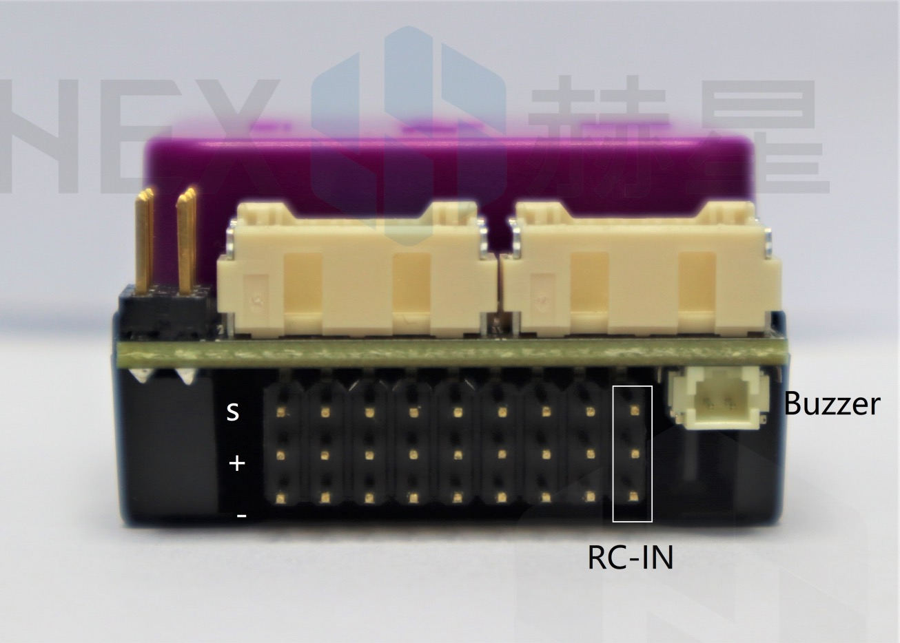
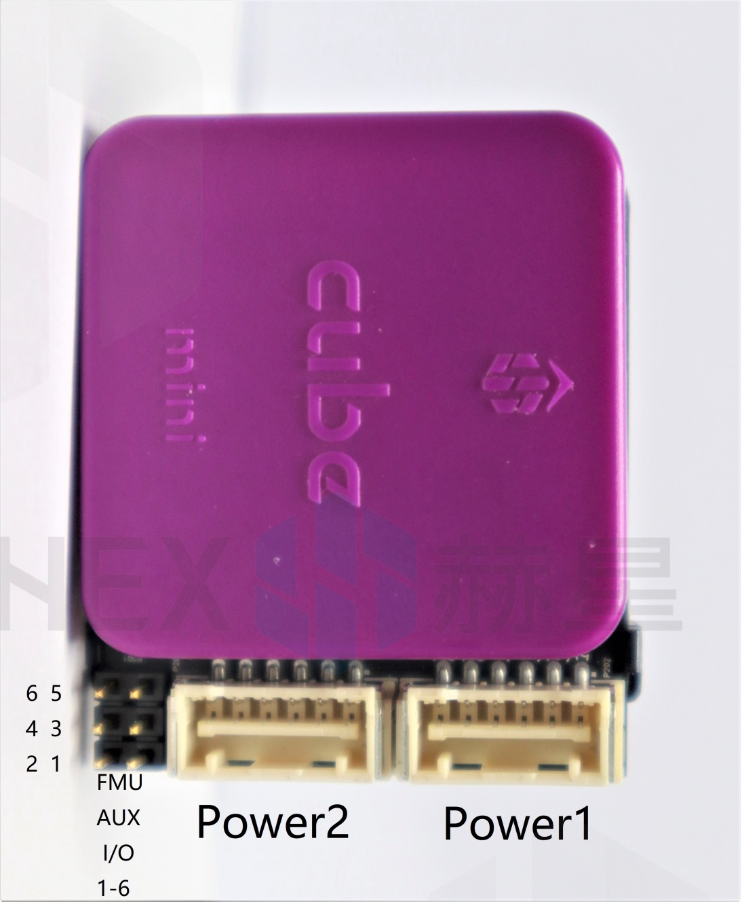
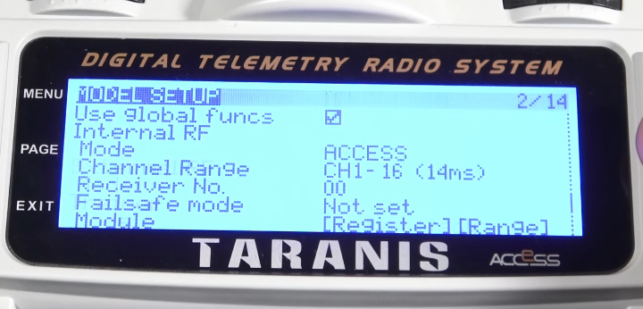
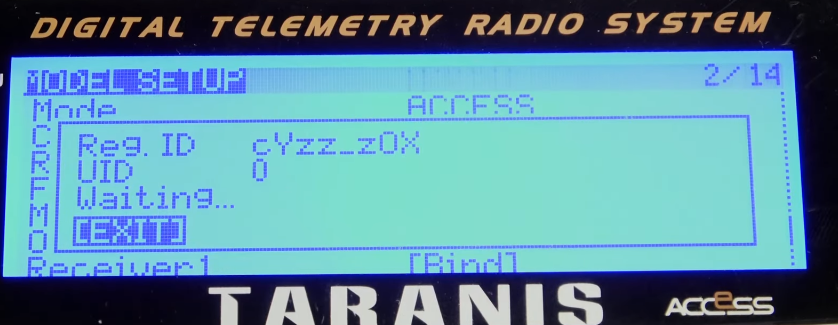
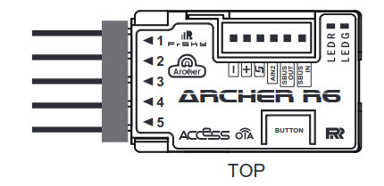
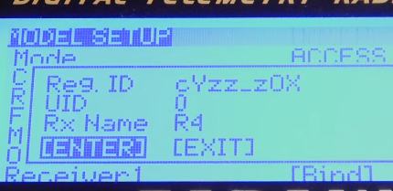
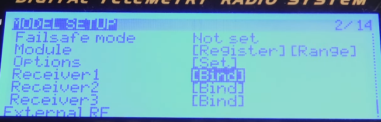
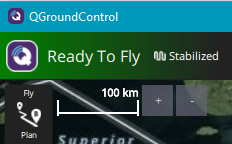
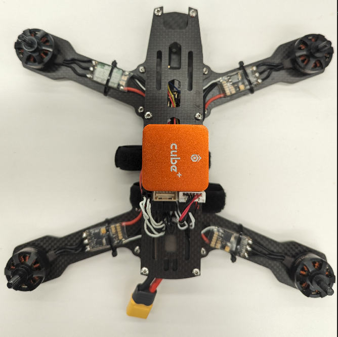

# Setting Up Your Drone to Fly *Safely*

Authors: Xuan Wang and Jonathan Kelly

As your first challenge in the capstone course, each team will need to assemble your drone, configure it properly, and pass the "run up" demonstration to prove that your aircraft is **air-worthy**. The demostration (Challenge Task #1) will happen soon after the safety lecture, where each team will chose a time slot to meet with TAs. During the "run up" demo, everything will happen on the ground; your team must follow and pass all the [checklist items for the course](https://q.utoronto.ca/courses/299314) and short interviews by the TAs (with some simple questions) to show that you have **fully understood** all the safety guidelines and pre-flight/post-flight procedures. **Prior to the demo, no team should install their propellers or fly their drone**. If the checklist test is passed and there is time left, the head TA will help your team carry out a quick test flight. This task might look simple, but it is the *most critical part* of succeding in later challenges (by ensuring a good foundation for safety).

This manual will help you get started with the  core steps of assembling the hardware and configuring the basic software of the drone for this course. PX4 is the recommended open-source firmware for the CubePilot's Orange Cube+  flight controller. The Ardupilot firmware-GCS is also widely used, and you are free to try it as you wish. Students are not expected to write low-level drone control code since this complexity is beyond the undergraduate level (given the time available for the capstone). This is why the PX4 open-source firmware has been and is still being actively developed by thousands of outstanding engineers worldwide. We hope that your work in this course will also be able to contribute to the open-source community!

For this course, the **main reference is the [PX4 Autopilot official documentation](https://docs.px4.io/main/en/)** (many languages are available!). The documentation is quite comprehensive. As you might have noticed, you do not need to read everything. The point of these instructions are to help you get a head start.

## Hardware Setup

You may want to start by assembling your [frame](https://rotorgeeks.com/download/Minion-Assembly-Manual.pdf) as the first step. The finished frame should look like the one shown in the manual and the example figure below. To align with the default (3D-printed) chassis, the "wide side" of the drone should point forward.

Within the kit, you will find that the PDB (power distribution board) is already soldered up with ESCs (Electric Speed Controller) and motors to save you time. Make sure the PDB is lifted up with the spacers so that it does not touch the carbon fiber frame. You are expected to check the correct avionics connections, referring to the **"Basic Assembly"** part of the PX4 document mentioned above.

- Make sure the autopilot's "POWER" port is connected properly to the PDB (Power Distribution Board).
- All four ESC connections to the Cube for motor control (refer to the figure below) are connected.
- The RC (Remote control) receiver connected to the Cube.
- The TeraRanger EVO 60m is connected to the Cube (with a cable in your kit)

It is highly recommended to connect the buzzer that is included in your kit. The buzzer provides valuable acoustic feedback about critical events such as arming, disarming, low battery etc. The buzzer can be connected to the relevant port on the cube:

    

### ESC interface to flight controller

- With the Orange Cube+ flight controller, the ESCs can be connected to the Cube in two ways. Using the flight management unit (FMU) main pulse-width-modulation (PWM) ports or the auxilary (AUX) ports. Note that the main PWM ports do not support Dshot protocol and might require ESC calibration. The AUX ports support Dshot protocol. The image above shows the PWM main ports ( s + -) and the image below shows the aux ports.

 

* The numbers 1-6 are included in the picture of the Cube+ to indicate which motor is which.  When using the DShot interface, you will use ports 1-4.  See the diagram below for the motor numbering.
  
* It is highly recommended to use Dshot protocol for communicating with ESCs. To the connect the ESCs to aux port, you can repurpose the servo connectors by combing the signal (white) wires from two ESCs into one connector and their corresponding ground (black) wires into another connector as is down below.

    

**Important Hints and Advice:**

- To connect the RC receiver to Cube, the wires that come with the receiver itself are incompatible and not useful. Please use the 5-pin Picoblade to 3-pin Servo lead wire that is provided in your kit. Be careful not to break the connectors.

- It is recommended to learn to manage your team's own document repository and development logs as you proceed in the course. You will often refer to the ESC and motor numbering and rotation direction, as recognized by the flight controller. You should strictly follow the figure below when connecting ESCs to the flight controller, checking motor directions, and installing your propellers.

## Firmware/Ground Station Setup

In practice, the correct avionic connections will not fully ensure that the motors will work properly. All the settings and parameters can be modified with the ground control station (GCS) software. It is recommended to use QGroundControl (referred to as **QGC** in the following sections), which supports most OSes. Please refer to the **"Basic Configuration"** part of the PX4 documentation.

## Firmware
The autopilot firmware should already be installed on your Cube+ flight controller. We will be using PX4-Autopilot firmware version v1.14.#. Please do not install a different firmware as compatibility of firmware-specific parameters is not assured.

## Setup 
First, open QGC and click the logo on the top left to enter the vehicle setup page. Make sure the airframe is selected as **"Generic Quadcopter"**. Every time you plug in the flight controller using the micro USB cable, QGC should auto-detect it and connect automatically (it might require multiple attempts in some cases).

If you go to vehicle setup, you will see a list of items to do on the left of the screen. Please check in sequence and configure everything accordingly. The key settings are:

- Airframe (Generic Quadcopter)
- Sensors (Calibrate everything for the first setup or whenever you think necessary)
- Radio **(to be explained more in detail in the next section)**
- Flight modes **(to be explained more in detail in the next section)**
- Motor testing (make sure the rotation direction is correct)
- Safety (Low Battery -> Land; RC Loss -> Kill)
- Parameters (much more flexible settings!)

The Cube is sensitive to vibrations and hence some PID tuning might be required. For motor testing, you can use a wide strip of paper/plastic to touch the top of the motor to reveal the rotation direction. In any case, if the motor direction is incorrect, use the MAVLink command as noted here https://docs.px4.io/v1.12/en/peripherals/dshot.html#commands to change the rotation direction.

## Radio Setup

As introduced above, radio setup and flight modes need more work. It may also take some time for you to learn how to use the Taranis Remote Control Transmitter (that will be referred to as "Taranis" in the following sections) since it provides remarkable flexibility and is more advanced than the toy-level remote controllers you find with many drones!

Before binding the Taranis to the receiver, you need to first check the RF module firmware version on the Taranis. On the main screen, long press the [MENU] button, and you will enter the general setting menu for the entire Taranis. Short press the [PAGE] button multiple times to go to page 7, and you can check the [Modules/RX Version].
If your internal RF module is active (by default, the original antenna), you should see the module name ISRM-M. If you see the version is ISRM version 1.1.3 FCC it will *not* work with the ARCHER R4 receiver provided to you. If it is 2.1.0 FCC or higher, then the receiver and transmitter are tested to work together if you follow the register/binding procedures correctly.

#### Binding Taranis transmitter with receiver

To verify if the transmitter and receiver allotted to your team are already *paired* or not, turn on the transmitter and reciever (by connecting it to the flight controller). If the receiver displays a solid green LED, then this indicates that the transmitter and the receiver are already paired. Please make sure that no other transmitters are turned on in the vicinity as your receiver may be bound to a different transmitter.

If the LED on your receiver is not solid green, then follow the directions below to bind your Taranis transmitter with the RC receiver (the ARCHER R4). 

The following PDF and YouTube video will be helpful and walk you through the procedure outlined below:
* [PDF: Receiver manual](https://www.frsky-rc.com/wp-content/uploads/Downloads/Manual/ARCHER%20R6/ARCHER%20R6-Manual.pdf).
* [Video: Binding procedure](https://www.youtube.com/watch?v=1oAvJ85TjQ0).

1. Turn on your transmitter and select your **Model**. Scroll all the way down until you see the panel shown below. 

2. Scroll down to Module option and select **Register** by pressing on the roller on your transmitter. This should put the transmitter in binding mode as below.

3. While the receiver is unpowered, press the bind button on your receiver (highlighted as button in the bottom figure).

4. Turn on the receiver by connecting it to a powered flight controller (while holding the bind button). 
5. The transmitter should recognize the receiver and its panel should display a message similar to below:

6. Click Enter. The RED LED and GREEN LED on the receiver will flash, and the transmitter will display
[Registration ok]. Release the button on the receiver at this point and turn it off.

7. On your transmitter, in the Model Setup page, scroll down to **Receiver 1** and click on bind:
 

The message "Waiting for RX" should pop up on the LCD panel.

8. Turn on your receiver. The GREEN LED will flash, indicating it is ready to bind and the LCD panel should display the reciever, click enter to confirm. The message **Bind successful** should now be displayed on the transmitter panel.

Once the receiver is bound and has a constant green LED light, you should then check in the "Radio" tab of GCS if you can see the channel inputs. If the receiver is stuck in the reg mode, contact your TA.

Controls on the Taranis are generally mapped to the "American Hand" as shown in the figure below. If you would like to control your drone in another fashion, please notify the TAs and the professor. Remember to perform calibration when you first set up and ensure that the channel mappings are correct (for example, you do not want the moving throttle on the RC to appear to be pitch in the flight controller!). If the mapping is incorrect, you can change the channel setting in Taranis.

## Flight Mode Setup

In the Flight Mode section in QGC, you can assign channels for the flight mode switch, arm switch, and **emergency kill switch**. The suggested channel/switch mapping is listed in the table below. The flight modes used in this course are 'Stabilized', 'Altitude', and 'Offboard'. They are explained in the PX4 documentation "Flying" section. Please read this carefully and make sure you understand both the behavior and the sensors involved. 

| Switch Name (Function) | Hardware Switch | Channel |
|------------------------|-----------------|---------|
|Flight Mode Switch      |SB (longest stick on the front panel)| Channel 5 |
|Arm Switch              |SA/SC (shorter sticks on the front panel)| Channel 6 |
|Emergency Kill Switch   |SD (left top side switch, sorry for other-handed person)| Channel 7 |

To switch the flight mode, you must first set up the Taranis to map between the hardware switches and the wireless channels. These features can be found by first pressing [MENU] and then [PAGE] to enter the detailed model settings. Short-pressing the [PAGE] button will loop through the pages (long press goes back, fun fact: Xuan has been using the Taranis for four years and just found this recently :)) until page 6/12, the MIXES, where you will find all the empty channels to be allocated from channel 5. The modified profile should look like this:

Once this is done, go back to QGC; you can simply select among channels to map them to the functions accordingly. If your RC connection is active, you will be able to see the function name highlighted when you flip the switches. 

## Autopilot configuration
After sensor calibration, flight mode setup, please configure the autopilot by following the procedure outlined in [OrangeCubePlus setup](../hardware/orange_cube_plus.md)

## Final Checks

If you have done everything correctly and have an active RC connection, you will be able to see this on the top left corner of the main page:

However, this only means that your autopilot is ready to Arm - your drone might still not be ready to fly. Before you can call the drone air-worthy, please *carefully* check the following:

- Can I arm the drone, switch to whatever flight mode I like, and then **kill** it whenever I want?
- Are the motors rotating in the correct directions?
- Are all the components installed tightly and in proper positions, with all wires secured?

The ready-to-test drone should look like this, with all the components installed tightly to the frame.

Finally and most importantly, we cannot emphasize the importance of **the [safety checklist](https://github.com/utiasSTARS/ROB498-support/blob/main/safety/rob498_safety_guidelines_and_checklist.pdf) and safety being at the top of your mind**, always. Please make sure all your team members fully understand the operation of the drone, and **do many rehearsals** before the demo (we will pick a random person as the "pilot" to hold the Taranis!). The detailed grading policy will be posted shortly in another document.  

If you have more questions, feel free to consult Google, post on the discussion boards, or ask the TAs/professor. You will have a fairly long time for this task. Thus, try to avoid squeezing everything right up to the deadline, since there is a considerable amount of information to digest. If you finish early, there are a lot of other tasks ahead of you to **continue to look into**, such as configuring your Jetson Nano, modifying/redesigning/printing the chassis, learning to perform a simple hover, using the Vicon system, and using the MAVLink API(MAVSDK/MAVROS) to control the Pixhawk with Jetson Nano. The deeper you understand each topic, the more you can do with this drone platform!

## Attempting first manual flight
When attempting your first manual flight, increase the throttle gently while keeping an eye on vibrations and oscillations. If the quadrotor begins to vibrate or oscillate on the ground as the throttle is increased, it is a sign of poor tuning and/or loose components. Disarm the drone and check if everything is fastened properly and the parameters are set correctly. If the vibrations persist, you may need to perform additional tuning.  
