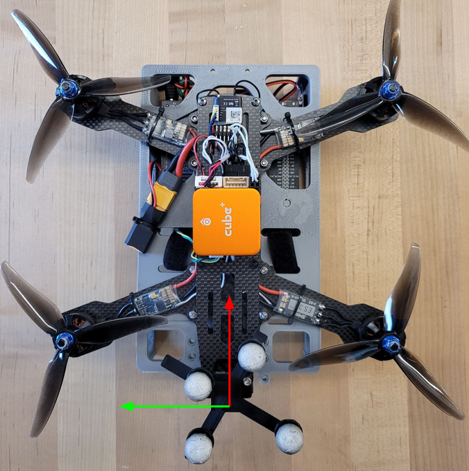

## Coordinate Frame 

The 'ROB498_Drone' object in the Vicon system has its coordinate frame defined as shown in the images below. The x axis (red) is along the longitudinal of your drone body, the z axis is upward, and the y axis (green) forms a right-handed coordinate frame with the other two axes.

## Transform to Drone

The exact transform between the marker and your drone’s coordinate frame will depend on what you use as your base frame (by default the centre of the cube) and where your cube is located relative to the marker. This is something you will have to either measure or find via calibration. 

