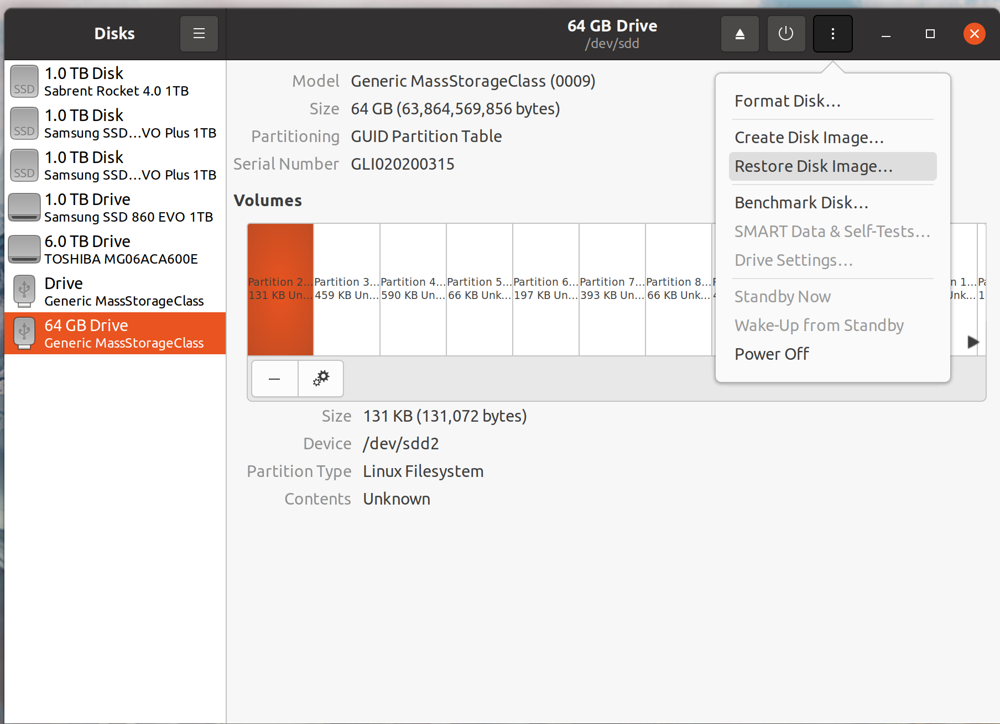

Modify for CubePilot Orange Cube+.

# Getting Started With Your Jetson Nano

The NVIDIA Jetson Nano is a mini computer widely used amongst robotics enthusiasts. In this course, we will use the Jetson Nano as the computing unit for your drone, to complete a set of autonomous flight challenges. Before beginning, you should take a look at the official [NVIDIA Instructions](https://developer.nvidia.com/embedded/learn/get-started-jetson-nano-devkit) that explain how to set up your device.

NVIDIA provides an [SD card image](https://developer.nvidia.com/jetson-nano-sd-card-image) that contains a custom version of Ubuntu 18 for your Jetson. We also provide a modified version of the image that comes with a set of pre-installed packages for easier setup.

To use the pre-configured image, first download the zip file [here](https://drive.google.com/file/d/1c-AUyDF2ZgA6t0d_pnyBmTgDt-NZ41I6/view?usp=share_link) and unzip it on your Ubuntu host machine. Note that you will need at least 64 GB of free disk space to store the unzipped image file. Next, connect the provided microSD card via a reader to your host computer and open the **Disks** app. Select the SD card from the drive list on the left and then use the **Restore Disk Image...** option in the menu to flash the disk image to the microSD, as shown in the figure below. The process will take about 20 minutes.

Once finished, insert the microSD into the Jetson and power it on. The username and password are both *rob498*. The system comes with the following packages installed:

- ROS Melodic
- MAVROS
- Intel Realsense SDK 2.0
- Auterion VIO

## ROS - The Robot Operating System

ROS is a set of libraries and tools that help people build robot software. If you have never used ROS before, we encourage you to go through the [ROS tutorials](http://wiki.ros.org/ROS/Tutorials) that are available online. In the following sections, we will use ROS as the communication platform to talk to various sensors and to the avionics. However, this is not mandatory and you can use other software such as MAVLink.

## MAVROS

MAVROS is a ROS package that provides a wrapper for the MAVLink protocol. We use it as a bridge between the Jetson Nano and other devices such as the Pixhawk 4 Mini flight controller.

## Intel Realsense VIO

The Intel Realsense T265 Tracking Camera provides a fully self-contained visual-interial odometry capability to your drone. We will use the estimated pose from the T265 camera to localize the drone when flying. The pre-installed [Auterion VIO](https://github.com/Auterion/VIO) package provides an easy way to communicate with the camera and obtain the estimated pose via MAVROS.

# Communication Between the Jetson Nano and Pixhawk 4 Mini

Setting up communications between the Jetson Nano in the Pixhawk requires two steps: first, wiring the two devices together, and second, configuring the appropriate communications parameters.

## Wiring Between the Jetson Nano and Pixhawk 4 Mini

The Pixhawk 4 Mini's **Telem 1** port can be connected to Jetson Nano's **GPIO** pins using the JST-GH-to-Dupont connector provided in your kit. This [video](https://www.youtube.com/watch?v=nIuoCYauW3s) provides instructions on how to connect the pins. Since the jumper cable is provided, you do not need to do any soldering. In summary, you will:

- Connect **Pin 2** of **TELEM1** (TX/out) on Pixhawk 4 Mini to **Pin 10** of **GPIO** (UART_RX/in, /dev/ttyTHS1) on Jetson Nano
- Connect **Pin 3** of **TELEM1** (RX/in) on Pixhawk 4 Mini to **Pin 8** of **GPIO** (UART_TX/out, /dev/ttyTHS1) on Jetson Nano
- Connect **Pin 6** of **TELEM1** (Ground) on Pixhawk 4 Mini to **Pin 9** of **GPIO** (Ground) on Jetson Nano

## Configure Pixhawk 4 Mini

Before the two devices can communicate with each other, we need to set some parameters on Pixhawk 4 Mini. Download and install **QGroundControl (QGC)** on your host computer by following the instructions [here](https://docs.qgroundcontrol.com/master/en/getting_started/download_and_install.html). Connect the Pixhawk 4 Mini to the computer and once it shows up in QGC, set the following parameters ([tutorial](https://docs.qgroundcontrol.com/master/en/SetupView/Parameters.html)):

- *SER_TEL1_BAUD* to 921600
- *MAV_0_RATE* to 921600

You may also [calibrate the sensors](https://docs.qgroundcontrol.com/master/en/SetupView/sensors_px4.html) in QGC.

## Configure the Jetson Nano

The Jetson Nano will communicate with the Pixhawk 4 Mini through the `/dev/ttyTHS1` device (i.e.,a serial port) and we need to grant read and write permissions. In a terminal on Jetson Nano, execute the following command:

`sudo chmod 666 /dev/ttyTHS1`

## Test the Connection - Get Your Pose from the Pixhawk!

Now the two devices are ready to talk to each other! To test the comms, we can run the following commands on Jetson:

- In the first terminal, launch ROS by running `roscore`
- In the second terminal, launch MAVROS by running `roslaunch mavros px4.launch`. The launch file already contains the necessary modifications to communicate with the Pixhawk
- MAVROS by default publishes information at a very low rate, or not publishes them at all. We can enable data streams, and set the publish rate by running `rosservice call /mavros/set_message_interval TOPIC_ID DESIRED_RATE` in the third terminal. Topic IDs can be found [here](https://mavlink.io/en/messages/common.html). For example, if we want to publish odometry (pose) at 100 Hz then we can run `rosservice call /mavros/set_message_interval 331 100` where 331 is the ID for odometry. 
- To verify, we can check the publishing rate by running `rostopic hz /mavros/odometry/in` in the fourth terminal. You can also use RViz to visualize the vehicle pose.

# Use Realsense T265 Tracking Camera For Pose Estimation

The Pixhawk Mini only uses the internal IMU to estimate its pose, which could drift over time. Fortunately, the Realsense T265 camera can use both the IMU and viusal feature to provide more stable pose estimations. First, you need to connect the camera to the Jetson using the provided USB3.0 cable. The Auterion VIO package is installed at `~/thirdparty/vio_ws`. Source this ROS workspace and run `roslaunch px4_realsense_bridge bridge_mavros.launch` to launch the bridge. The estimated poses should be published under the `/mavros/odometry/out` topic.

# Wifi

This section provides instruction on how to setup the wireless (wifi) interfact on your Jetson Nano. 
- Boot your Jetson Nano and connect it to Ethernet. The TP-Link AC1300 dongle should *NOT* be plugged into any of the USB ports.
- Install *git* on your Jetson: `sudo apt install git`
- Clone the driver to your Jetson: `git clone https://github.com/RinCat/RTL88x2BU-Linux-Driver.git`
- Build and install the driver: `cd RTL88x2BU-Linux-Driver && make ARCH=arm64 && sudo make install`
- Reboot your Jetson
- Plug in the TP-Link dongle and your wifi connection should work (i.e., you should be able to choose a network to connect to)

# Running Ubuntu and ROS in a Docker Container

NVIDIA currently supports Ubuntu 18.04 on the Jetson Nano. The compatible ROS version is Melodic Morenia. Both the OS and the ROS version are somewhat dated (as of 2023).

Thankfully, EngSci Robo Jonathan Spraggett has come to the rescue by providing an updated Docker container (image) that is set up to run Ubuntu 20.04 and ROS Noetic Ninjemys! The container supports access to the Jetson CUDA cores, too!

You can find Jonathan's instructions and support code on GitHub [here](https://github.com/manx52/ROB498), and the Docker image on DockerHub [here](https://hub.docker.com/r/utrarobosoccer/rob498).

# Receiving Vicon Poses via ROS Using Wifi

Vicon is a high precision tracking system that can provide real-time pose estimate to the drone during flight. We have step up the infrastructure so your Jetson Nano can access data from the Vicon sysetm using onboard Wifi in the format of ROS messages. This section provides the instruction on how to configure your Jetson in order to join the ROS network.

First, you need to connect your Jetson to our router. The SSID is `TP_LINK_ROB498` and the password is `rob498drones`. Once connected, you should set up static IP for the Jetson. To do so, open **Settings**, and navigate to the **Wi-Fi** tab. Click on the arrow beside the connection to open the network interface dialog box. Go to the **IPv4** tab, and change the **IPv4 Method** to **Manual**. In the **Address** box, enter **10.42.0.1xx** where *1xx* should be *100* + *your team number*. For example, if you were team 12 then your IP should be *10.42.0.112*. Next, in the **Netmask** box, enter **24**. Save and close the window. The setting will be applied after you reconnect to the network. Verify that your IP address has been updated using the **ifconfig** command.
  Now you should be able to subscribe to the Vicon pose messages using ROS. To verify, open a new terminal window and run the following command:
- `export ROS_MASTER_URI=http://10.42.0.100:11311`
- `export ROS_IP=*YOUR_IP*`
-  `rostopic echo /vicon/ROB498_Drone/ROB498_Drone`
 
 The Vicon poses will published as [TransformStamped](http://docs.ros.org/en/noetic/api/geometry_msgs/html/msg/TransformStamped.html) messages as well as in the `/tf` topic. If you do not see any messages being printed, reach out to your TA. Note that you must run the first two `export` commands in the terminal every time you want to launch a ROS node. Moreover, all ROS nodes should be connected to the `roscore` on the scoring computer, not on your Jetson.
