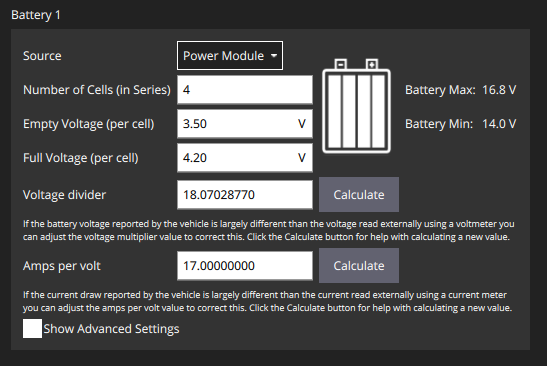

# CubePilot Cube Orange+ Flight Controller

The Cube Orange+ is a flight controller developed CubePilot. It features multiple vibration-isolated redundant inertial measurement units (IMUs). The controller (housed in the orange Cube) can be used with commerically available carrier boards or with custom designed carrier boards. In this course, we are using the mini carrier board. Details on the mini carrier board can be found here:

https://docs.cubepilot.org/user-guides/carrier-boards/mini-carrier-board

The Cube Orange+ can be configured to work with the open source PX4 Autopilot using the QGroundControl program. More information about the Cube Orange+ can be found here:

https://docs.px4.io/main/en/flight_controller/cubepilot_cube_orangeplus.html

## Drone Setup with QGroundControl

Multiple internal sensors and external modules/connections require configuration to function properly. These actions can be carried out using the QGroundControl software on a separate setup machine. QGroundControl can be installed on Windows, MacOS, and Ubuntu systems - we recommend running it on MacOS or Ubuntu since the Windows version has some startup and video rendering issues. 

See the following link for installation instructions:

https://docs.qgroundcontrol.com/master/en/getting_started/download_and_install.html

Once QGroundControl is installed and running, you can connect the Cube to your setup computer using a USB->microUSB cable. The Cube does not come with a firmware pre-installed. The first step is to upload the PX4-Autopilot (firmware) on to the Cube.

### Firmware

Navigate to **Vehicle Setup/Firmware**. Unplug the Cube and wait for the prompt to reconnect. Once connected, select the **PX4 Pro Stable Release** (the latest **stable** firmware **version 1.14.0** is preferred) flight stack from the righthand menu and wait for it to install. Once the firwmare has been successuflly installed, the next step is to configure the Cube.

### Setup

Once the firmware is installed, QGroundControl should automatically detect it. By clicking the QGroundControl logo in the top left corner, you can enter either the **Vehicle Setup** or **Analyze Tools** screens, which will be relevant for later sections.

If you navigate the the **Vehicle Setup** section, you will see a summary of Cube modules that must be configured before use.

### Sensor orientation

The Cube can be installed in any orientation on the quadrotor. If the *front* of the Cube is not aligned with the *front* of the quadrotor, (as in the figure below) then sensor orientation has to be set accordingly using the `sensor orientation` tool. You are free to mount the Cube in an orientation of your choice. Make sure to set the orientation accordingly.

<p align="center">
    
</p>

In the figure above, the front of the Cube (as indicated by the arrow on the cube) is rotated (90 degrees in NED frame with respect to the front of the quadrotor). The motivation for mounting it this way is to keep the cabling tidy and avoid cables hanging on the side.

### Sensors

Navigate to **Vehicle Setup/Sensors**. Follow the instructions for calibrating the **Compass**, **Gyroscope**, **Accelerometer**, and **Level Horizon** modules by clicking on each tab in order.

### Flight Modes

Navigate to **Vehicle Setup/Flight Modes**. After completing the radio controller setup, you can bind specific hardware switches on the handheld RC (denoted as "channels" in QGroundControl) to specific actions. While you will be flying your drone in this course using commands sent from the Jetson Nano, it is useful for safety purposes to enable flight using the RC.

We recommend that you bind **Arm Switch Channel** (which readies the motors for use), **Emergency Kill Switch Channel** (which cuts power to the motors), and **Offboard Switch Channel** (which toggles control from the Jetson) to easily-accessible switches. 

You should also use a separate channel for the **Flight Mode Settings** to easily enter modes like **Manual** and **Stabilized**. You may also wish to control entry to **Offboard** mode from here.

### TELEM2 (Jetson Nano)

The Cube's TELEM2 port is a port for communication with an onboard computer using Mavlink protocol. For use with the Jetson Nano, the TELEM2 port is wired up to the GPIO pins on the Jetson through a UART-based serial connection (see **Wiring and Connections** above).

The Jetson GPIO pinout configuration can be found here:

https://www.jetsonhacks.com/nvidia-jetson-nano-j41-header-pinout/

Pins **6**, **8**, and **10** in the Jetson Header board are used for the UART connection to the Cube. Note that for UART connections, RX -> TX and TX -> RX from the Jetson to the Cube. Pin **6** may be labeled as **GND** on the physical Jetson board, but it is in the space specified by the above link and should be wired to the GND pin of the TELEM2 port. A connection cable (6-pin JST-GH to 3-pin Dupont) is provided in your kit.

Note the address for these UART pins on the Jetson header board is listed as ``/dev/ttyTHS1``, which will be useful when setting up a MAVROS based connection for these devices.

## Other Parameters

The following sections mainly concern parameters that can be found in the **Parameters** section of QGroundControl (**Vehicle Setup/Parameters**). You can use the search bar at the top to quickly find these parameters and keep track of what has changed using the "Show modified only" search option. Modified parameters will be highlighted in red and many will have been set by the actions performed in the **Drone Setup with QGroundControl** section of this guide. Changing some parameters will require a reboot of the Cube, which can be accomplished by disconnecting it from power and from the setup computer. 

### PID and filter tuning
The Cube+ comes with vibration isolated IMUs. Nonetheless, it is sensitive to vibrations, as such it is recommended to soft mount the flight controller. Even with a soft mount it is necessary to modify the stock PID values for stable flight. The following parameters have worked well:

```
- MC_ROLLRATE_D -> 0.0001
- MC_ROLLRATE_P -> 0.08
- MC_PITCHRATE_D -> 0.0001
- MC_PITCHRATE_P -> 0.08
- IMU_DGYRO_CUTOFF -> 95
- IMU_GYRO_CUTOFF -> 50
```

The quadrotor response might seem sluggish with these PID values. You can tune the PID values for a more crisp response but please do so by changing the values in **very** small increments. 

**NOTE**: *PID tuning can be quiet challenging and must be avoided unless  necessary.*

### Onboard Jetson Communication

Communication with the Jetson Nano is through the GPIO pins and must be configured by changing a few parameters. First, enable Mavlink communication on TELEM2:

 - MAV_1_CONFIG      -> TELEM2

Reboot the flight controller. Next, you must configure the Cube to send and receive MAVLink messages at an acceptable rate. This can be done by setting the following parameters:

- MAV_1_MODE        -> Onboard
- SER_TEL2_BAUD     -> 921600 8N1

<p align="center">
    
</p>

The above figure shows JSG-GH cable connected to TELEM2 port of the cube.


### Offboard Position Estimation

Because the Cube is normally configured to receive position information from a GPS module and this course is conducted indoors, you need to supply a position estimate from an external source. This can be done by passing odometry messages through MAVROS on the topic `/mavros/vision_pose/pose`.

The Cube fuses position information through an EKF2 module, which has many configuration parameters. To set up the Cube to fuse this external information, you need to set the following parameters. 

Enable EKF2 to use height reported by visual inertial odometry (VIO) or Vicon:

- EKF2_HGT_REF      -> Vision

Enable EKF2 to use 3D position and yaw from external source:

- EKF2_EV_CTRL      -> 11

Note 3D velocity is not available by default when using motion capture system. However, it is available when using T265 as source of VIO. If 3D velocity is avaiable:

- EKF2_EV_CTRL     -> 15

Optinally, disable GPS:

- EKF2_GPS_CTRL    -> 0

If the source of height information (such as VIO or a range sensor) is reliable, optinally disable barometer:

- EKF2_BARO_CTRL   -> Disabled

Additional information on fusing external pose information with the autopilot's estimator and frame conventions can be found at the following link:

https://docs.px4.io/v1.14/en/ros/external_position_estimation.html#using-vision-or-motion-capture-systems-for-position-estimation

To enable loopback of odometry measurements over MAVLink, set the following parameter:

- MAV_ODOM_LP       -> 1

### TeraRanger Evo Configuration

The Cube is designed to recognize rangefinder devices like the TeraRanger Evo 60m. However, because of the wide range of devices that may be connected through the I2C port, you must specify that the Evo as the connected device. This can be done by setting the following parameter:

- SENS_EN_TRANGER   -> TREvo60m

If you want the range sensor to be the source of height information then set the following parameters

- EKF2_HGT_REF -> Range sensor

## Battery setup

The flight controller has an internal sensor to monitor and report the battery status. Since, the sensor needs to operate across a range of voltages, calibration to your specific battery type may be needed. The following steps provide instructions to calibrate the battery monitor.

* Connect the flight controller to QGroundControl.
* Navigate to the "Power" section. It should look something like below

<p align="center">

</p>

* If the power cord is connect as below, then set battery 1 source to `Power Module`. 

<p align="center">
    
</p>


* Since we are using a 4-cell LiPo battery, the following parameters need to be set:
```
Number of cells -> 4
Full voltage -> 4.20
Empty voltage -> 3.5
```

* Next, measure and record the voltage of your LiPo using a multimeter, a LiPo checker, or the LiPo charger.

*  Click `Calculate`` next to the Voltage divider field. 

<p align="center">

</p>

* On the prompt that appears:
    * Enter the measured voltage (recorded using multimeter).
    * Click Calculate to generate a new voltage-divider value.
    * Click Close to save the value into the main form.

A similar process can be followed to calibrate the amperage.

Once calibration is done, confirm that the battery voltage reported by QGroundControl in the main page is accurate. For instance, for a fully charged LiPo (`16.8v`), the main page of QGroundControl should read as below:

<p align="center">

</p>

Hovering over the battery icon will show the voltage as measured by the onboard sensor.

It is encouraged to calibrate voltage as the buzzer will notify when the battery is low and can help avoid any potential problems.

More information can be found here: https://docs.px4.io/main/en/config/battery.html#basic_settings.

## More Information

More information about the PX4-Autopilot is avaiable in the official Getting Started guide:

https://docs.px4.io/main/en/getting_started/
