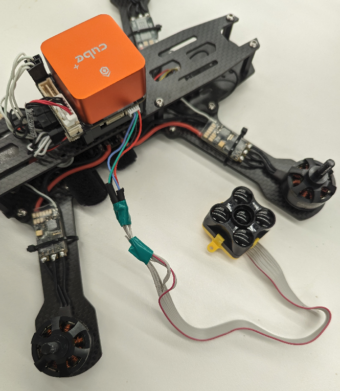

# Terabee TeraRanger Evo 60m

The TeraRanger Evo 60m is an infrared time-of-flight range sensor with a detection range of up to 60 meters. It comes with a main black module and two yellow backboards that provide communication support and power connections.

## Hardware Setup

To connect the Evo to your drone you can use either of the two communication backboards, which are configured with either a USB 2.0 cord or UART/I2C ribbon cable. This setup (along with the following sections and separate starter code files) uses the I2C port for connection to the Orange Cube+ as it provides an easy way of integrating measurements over ROS.

The I2C protocol must be used when wiring up a connection to the Evo (SDA->SDA, SCL->SCL, GND->GND, and VCC->5V, from the Cube to the Evo). Once the correct wires are connected, the Evo can be plugged directly into the **I2C** port of the Cube as shown below.

<p align="center">
    
</p>

For help with wiring, see the following:

https://www.terabee.com/connection-to-pixhawk-autopilots-teraranger-evo/

## Software Setup

Note that the Cube requires the correct driver to work with the Evo and communicate properly. This driver is usually present in the default PX4 firmware, however you may also need to add the driver (``distance_sensor/teraranger``) to the board configuration on your own (very unlikely). You will know if the driver is missing if the following parameters/shell commands do not exist for you. See the following link for more information:

https://docs.px4.io/main/en/sensor/teraranger.html

In order for the Evo's measurements to be readable by the Cube (and eventually ROS), set the following parameter:

- SENS_EN_TRANGER -> TREVo60m

To ensure proper communication, you can navigate to the **MAVLink Inspector** in **Analyze Tools/MAVLink Inspector** and read data through the ``DISTANCE_SENSOR`` topic. This can only be done after the previous commands have been executed.

If you do not see any data in **MAVLink Inspector** you may need to start the driver manually. To do so, open the **MAV Console** terminal.
```
i2cdetect -b 2
```
Use the address found to set the parameter is
```
teraranger start -X -b 2 -a XX
```

## Usage Instructions

To recieve Evo measurements from ROS, you must first have the `mavros` and `mavros_extras` packages installed. `mavros_extras` already contains the correct plugin that reads MAVLink distance sensor measurements, but you need to enable this plugin by commenting out or deleting the "- rangefinder" and "- distance_sensor" lines in `mavros/mavros/launch/px4_pluginlists.yaml` file under the **plugin_blacklist** heading. 

You can view Evo measurements over the `mavros/distance_sensor/hrlv_ez4_pub` topic. Configuration of this topic (including configuring the position and orientation of the Evo with respect to the drone's base frame) can be accessed via `mavros/mavros/launch/px4_config.yaml` under the **distance sensor/hrlv_ez4_pub** heading.

### Height Estimation

Finally, it should be noted that Evo range measurements can be incorporated directly into the Cube's EKF2 module for position (height) estimation. THIS SHOULD ONLY BE DONE DURING OPERATION OVER FLAT SURFACES, AS CHANGES IN FLOOR HEIGHT/TEXTURE CAN CAUSE UNPREDICTABLE MOVEMENT.

To enable this function, you must open QGroundControl and change the `EKF2_HGT_MODE` parameter to "Range sensor", and configure multiple `EKF2_RNG_ ...` parameters for position/orientation of the Evo with respect to the Cube's velocity sensitivity, etc.