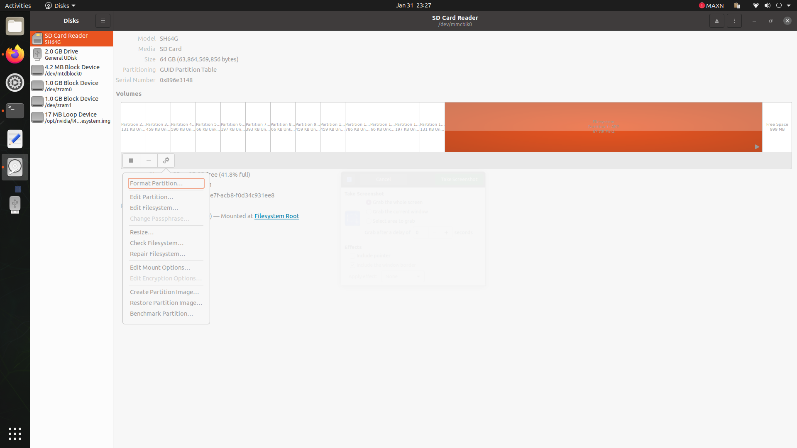
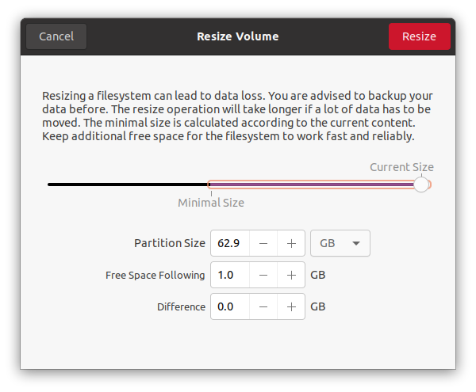

# Installing Ubuntu 20.04 on Jetson Nano V1 (with SD Card)

Follow the instructions outlined [here](https://github.com/Qengineering/Jetson-Nano-Ubuntu-20-image?tab=readme-ov-file), specifically under the [instructions](https://github.com/Qengineering/Jetson-Nano-Ubuntu-20-image?tab=readme-ov-file#installation) to flash your provided SD card.

By default, the image will only have about 30GB of available storage. To use the storage available on the SD card, follow these instructions:

1. Start the Jetson Nano with the flashed SD card.
2. Open the Disk manager by searching `Disks` in the apps. The app icon is a picture of a hard drive.
3. Find the main partition. It should be about 30GB. There should also be an empty unallocated partition that is about 30GB as well.

4. Resize the main partition to use up most of the SD card storage. Under the settings for the given partition, select `Resize` (pictured above). The resizing menu looks like this:

5. Check the storage available on the main partition afterwards.

## Considerations

Both ROS1 Noetic and ROS2 Humble are supported in Ubuntu 20.04. See the [ROS2 installation instructions](../setup_ros2.md) for further considerations when switching to ROS2.

# Installing Ubuntu 20.04 on Jetson Nano V2 (with builtin eMMC)

The newer [Jetson single board computers](https://category.yahboom.net/products/jetson-nano-sub) have builtin eMMC. Currently, we do not have a way to boot the newer Jetson computers from SD card. Instead, we will manually upgrade the pre-installed Ubuntu 18.04 to Ubuntu 20.04. Instructions for doing this can be found at the following link:

Upgrading jetson nano to Ubuntu 20.04: https://qengineering.eu/install-ubuntu-20.04-on-jetson-nano.html

NOTE: Do not use the SD card recommendation suggested in the above link.

NOTE: Instructions for flashing the onboard emmc with Ubuntu 18.04 can be found here: http://www.yahboom.net/study/jetson-nano

